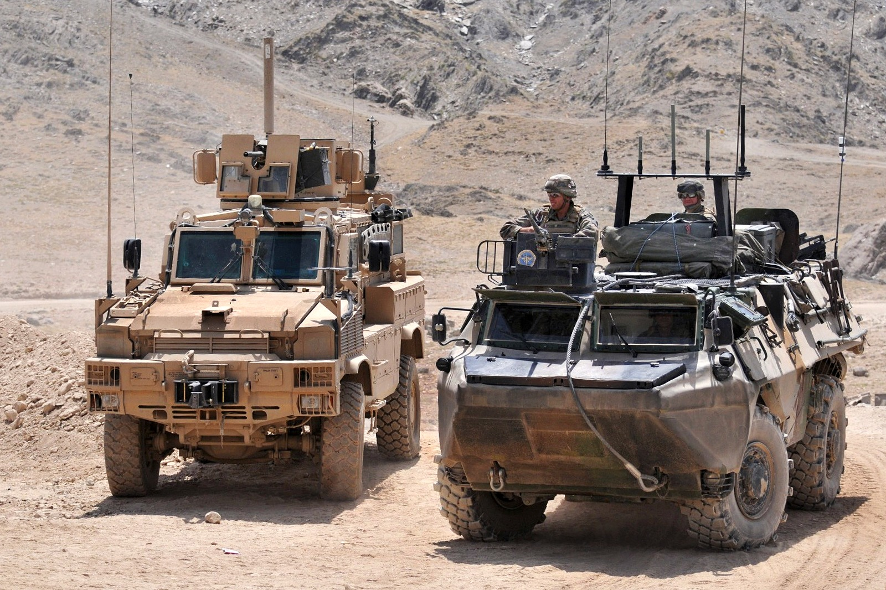

# Orion - Automated Target Recognition of Military Vehicles

🛰️ A deep-learning–based system for automated detection and classification of military vehicles in video and image data. Orion integrates visual recognition, motion analysis, and tracking modules to provide real-time situational awareness in complex environments.

<div align="center">
  
</div>

## Models

Orion uses YOLO12 models fine-tuned on custom datasets for detecting military vehicles (AFVs, APCs, Tanks, etc.).

| Model | size (pixels) | params (M) |
| --- | --- | --- |
| orion12n | 640 | 2.6 |
| orion12s | 640 | 9.3 |
| orion12m | 640 | 20.2 |
| orion12l | 640 | 26.4 |

## Installation

Orion requires Python >= 3.12.

### Install from GitHub

Clone the repository and install the project using `uv` (recommended):

```bash
git clone https://github.com/Tarub15/orion.git
cd orion
pip install uv
uv sync
```

## Usage

### Command-line

On Windows, you can use the provided `orion.bat` launcher to automatically use the correct virtual environment. 

To see all available commands:
```bash
.\orion.bat --help
```

#### Detect military vehicles in images

The `predict` command detects military vehicles in images. Use the `-s` flag to save the annotated image.

**Testing with new images:**

```bash
# Test Image 1
.\orion.bat predict resources\models\orion12n.pt testing\test1.jpeg -s

# Test Image 2
.\orion.bat predict resources\models\orion12n.pt testing\test2.jpeg -s

# Test Image 3
.\orion.bat predict resources\models\orion12n.pt testing\test3.jpeg -s

# Test Image 4
.\orion.bat predict resources\models\orion12n.pt testing\test4.jpeg -s
```

*Results will be saved in the `runs\predict` directory.*

<div align="center">
  
  
</div>

#### Track military vehicles in videos

The `track` command tracks military vehicles across video frames. 

```bash
.\orion.bat track resources\models\orion12n.pt resources\test\tank1.mp4
```

<div align="center">
  
</div>

## Contents

- `orion/`: Source code for YOLO12 fine-tuning and object detection.
- `resources/`: Contains test videos and pre-trained models.
- `testing/`: Contains new custom test images (`test1.jpeg` through `test4.jpeg`).
- `notebooks/`: Example Jupyter notebooks for dataset prep, training, and evaluation.
